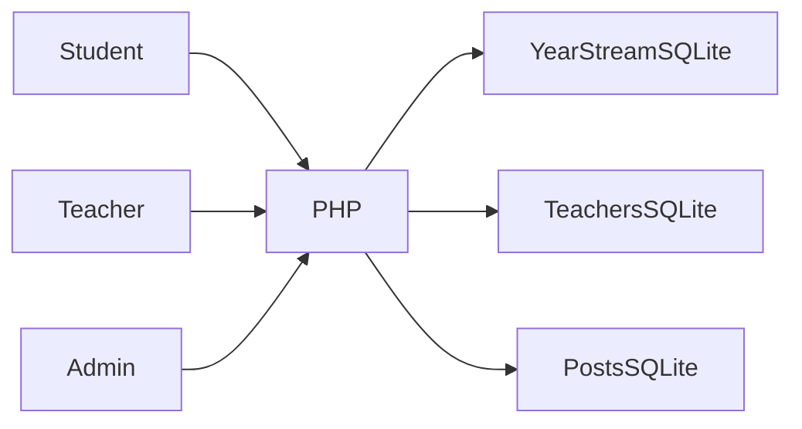

# FH-School

**بوابة مدرسية قديمة تعمل بواجهة عربية**

[English](README.md)

توفير واجهات للتلاميذ والمدرسين والإدارة حسب الدور لعرض السجلات الدراسية والتواصل.

**التقنيات:** PHP · SQLite · JavaScript · Arabic RTL

## الحالة والتاريخ

بوابة مدرسية قديمة تعمل. أكد المالك أن سجلات قواعد البيانات وهمية وتُوسم العينات بأنها اصطناعية.

هذه نسخة عرض منقحة للنشر. تعرض [وثيقة التحقق](docs/verification.md) الفحوص الحالية بصورة مستقلة عن النشر السابق.

## الوظائف والإجراءات

- لوحات التلاميذ والشعب والأقسام
- صلاحيات المدرس حسب المادة والقسم
- إدخال النقاط والملاحظات وسجل الغياب
- إعلانات ومرفقات
- إدارة المدرسين والتلاميذ ومخططات

يدخل التلميذ إلى سجل سنته ← يفتح المدرس مادة وقسماً مصرحاً بهما ← تُحفظ النقاط أو الغياب ← تنشر الإدارة الإعلانات وتدير الحسابات.

## البنية

## القرارات الهندسية

- توزع القواعد حسب السنة والفرع والشعبة مع مخزنين للمدرسين والمنشورات. يبسط ذلك البيانات الصغيرة لكنه يصعب التقارير والترحيلات المشتركة.
- حُفظ حقل اسم المستخدم وكلمة المرور التاريخي للحسابات المحلية الاصطناعية مع توثيقه. لا يصلح لبيانات تلاميذ حقيقية.
- تتحقق مسارات AJAX للمدرس من المصادقة وصلاحيات القسم والمادة قبل التنفيذ. يُحظر تنزيل القواعد مباشرة.
- تُحفظ الحالة التجريبية الأصلية كلقطة عينات، ويستعيدها أمر صريح يستبدل قواعد العرض فقط.

## المجلدات

| Component | Responsibility |
|---|---|
| `student.php` | Student authentication/dashboard |
| `teacher.php` | Teacher AJAX and dashboard |
| `management.php` | Admin accounts and announcement management |
| `student_management.php` | Admin academic records |
| `data/` | Synthetic distributed SQLite stores |

## التثبيت والإعداد

استخدم PHP مع PDO SQLite وSQLite3 والجلسات. شغّل `php -S 127.0.0.1:8083 router.php`. امنح الكتابة لقواعد ومرفقات العرض فقط. حسابات العرض في `docs/demo-accounts.md`. لا تعرض الخادم التطويري للعامة. أوقفه قبل تنفيذ أمر استعادة العينات.

توجد أوامر التشغيل ومتغيرات البيئة في [دليل الإعداد](docs/setup.ar.md). القيم أمثلة محلية أو حقول فارغة؛ لا تعِد استخدام بيانات إنتاج سابقة.

## العرض والتحقق

يدخل التلميذ إلى سجل سنته ← يفتح المدرس مادة وقسماً مصرحاً بهما ← تُحفظ النقاط أو الغياب ← تنشر الإدارة الإعلانات وتدير الحسابات.

استخدم حسابات وسجلات اصطناعية. راجع [خطوات العرض](docs/demo.ar.md) وسجل نتائج الفحوص الحالية. نجاح بناء مكون لا يثبت نجاح كل مسارات المنتج.

## الحدود

عرض محلي للإصدار الأول. يلزم تحديث تخزين كلمات المرور ومراجعة CSRF والمدخلات قبل استخدام سجلات حقيقية.

## التوثيق

- [البنية](docs/architecture.ar.md)
- [الإعداد](docs/setup.ar.md)
- [العرض](docs/demo.ar.md)
- [المسارات](docs/api.md)
- [الفحوص الحالية](docs/verification.md)
- [النشر وحل المشكلات](docs/deployment.md)
- [حقوق الأصول](THIRD_PARTY_NOTICES.md)

## المساهمة والترخيص

افتح مشكلة تتضمن خطوات إعادة الإنتاج والمكون المعني. استخدم بيانات اصطناعية وتعديلات مركزة وفحوصاً مناسبة، ولا ترسل أسراراً أو سجلات مستخدمين خاصة. الشيفرة بترخيص [MIT](LICENSE)، وتحتفظ الاعتماديات والأصول الخارجية بشروطها الأصلية.
