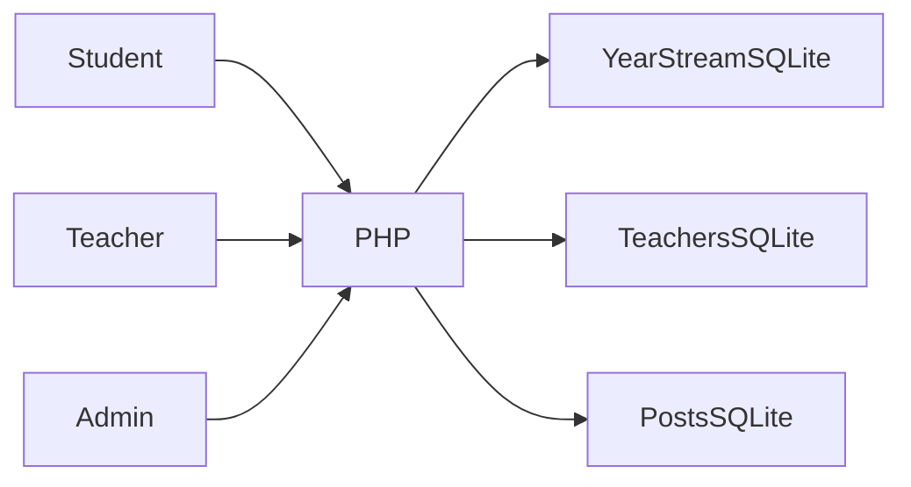
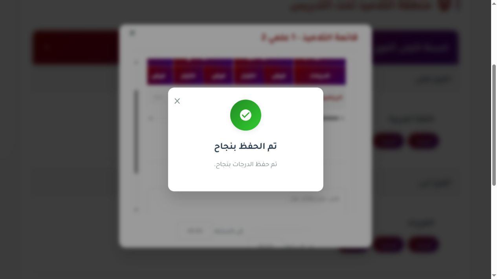

# FH-School

**بوابة مدرسية قديمة تعمل بواجهة عربية**

[English](README.md)

توفير واجهات للتلاميذ والمدرسين والإدارة حسب الدور لعرض السجلات الدراسية والتواصل.

**التقنيات:** PHP · SQLite · JavaScript · Arabic RTL

## الحالة والتاريخ

بوابة مدرسية قديمة تعمل. أكد المالك أن سجلات قواعد البيانات وهمية وتُوسم العينات بأنها اصطناعية.

هذه نسخة عرض منقحة للنشر. تعرض [وثيقة التحقق](docs/verification.ar.md) الفحوص الحالية بصورة مستقلة عن النشر السابق.

## الوظائف والإجراءات

- لوحات التلاميذ والشعب والأقسام
- صلاحيات المدرس حسب المادة والقسم
- إدخال النقاط والملاحظات وسجل الغياب
- إعلانات ومرفقات
- إدارة المدرسين والتلاميذ ومخططات

يدخل التلميذ إلى سجل سنته ← يفتح المدرس مادة وقسماً مصرحاً بهما ← تُحفظ النقاط أو الغياب ← تنشر الإدارة الإعلانات وتدير الحسابات.

## البنية

## القرارات الهندسية

- توزع القواعد حسب السنة والفرع والشعبة مع مخزنين للمدرسين والمنشورات. يبسط ذلك البيانات الصغيرة لكنه يصعب التقارير والترحيلات المشتركة.
- حُفظ حقل اسم المستخدم وكلمة المرور التاريخي للحسابات المحلية الاصطناعية مع توثيقه. لا يصلح لبيانات تلاميذ حقيقية.
- تتحقق مسارات AJAX للمدرس من المصادقة وصلاحيات القسم والمادة قبل التنفيذ. يُحظر تنزيل القواعد مباشرة.
- تُحفظ الحالة التجريبية الأصلية كلقطة عينات، ويستعيدها أمر صريح يستبدل قواعد العرض فقط.

## المجلدات

| المكون | المسؤولية |
|---|---|
| `student.php` | مصادقة الطالب ولوحته |
| `teacher.php` | طلبات AJAX ولوحة الأستاذ |
| `management.php` | إدارة الحسابات والإعلانات |
| `student_management.php` | إدارة السجلات الدراسية |
| `data/` | قواعد SQLite موزعة ببيانات اصطناعية |

## التثبيت والإعداد

استخدم PHP مع PDO SQLite وSQLite3 والجلسات. شغّل `php -S 127.0.0.1:8083 router.php`. امنح الكتابة لقواعد ومرفقات العرض فقط. حسابات العرض في `docs/demo-accounts.md`. لا تعرض الخادم التطويري للعامة. أوقفه قبل تنفيذ أمر استعادة العينات.

توجد أوامر التشغيل ومتغيرات البيئة في [دليل الإعداد](docs/setup.ar.md). القيم أمثلة محلية أو حقول فارغة؛ لا تعِد استخدام بيانات إنتاج سابقة.

## العرض والتحقق

يدخل التلميذ إلى سجل سنته ← يفتح المدرس مادة وقسماً مصرحاً بهما ← تُحفظ النقاط أو الغياب ← تنشر الإدارة الإعلانات وتدير الحسابات.

استخدم حسابات وسجلات اصطناعية. راجع [خطوات العرض](docs/demo.ar.md) وسجل نتائج الفحوص الحالية. نجاح بناء مكون لا يثبت نجاح كل مسارات المنتج.

## الحدود

تبقى كلمات المرور الاصطناعية القديمة نصاً واضحاً في قاعدة المثال. هذا عرض محلي قديم؛ السجلات الحقيقية تحتاج ترحيل تخزين كلمات المرور ومراجعة صلاحيات أوسع. نجح حفظ علامات وغياب الأستاذ؛ تبقى مسارات الإدارة والطالب ومراجعة الأدوار في المتصفح.

## التوثيق

- [البنية](docs/architecture.ar.md)
- [الإعداد](docs/setup.ar.md)
- [العرض](docs/demo.ar.md)
- [المسارات](docs/api.ar.md)
- [الفحوص الحالية](docs/verification.ar.md)
- [النشر وحل المشكلات](docs/deployment.ar.md)
- [حقوق الأصول](THIRD_PARTY_NOTICES.md)

## المساهمة والترخيص

افتح مشكلة تتضمن خطوات إعادة الإنتاج والمكون المعني. استخدم بيانات اصطناعية وتعديلات مركزة وفحوصاً مناسبة، ولا ترسل أسراراً أو سجلات مستخدمين خاصة. الشيفرة بترخيص [MIT](LICENSE)، وتحتفظ الاعتماديات والأصول الخارجية بشروطها الأصلية.

<!-- release-presentation -->

## من التطبيق الفعلي

هذه لقطة فعلية للواجهة المحلية، وليست دليلاً على استخدام إنتاجي أو فحص أندرويد.

## التحقق والقراءة المتعمقة

نجحت صياغة PHP وفحوص دخول الأستاذ التجريبي واشتراط CSRF وتحميل القسم المسموح ورفض قسم أو مادة غير مصرح بهما وحجب تنزيل قواعد البيانات مع إتاحة الصور العامة. نجح عرض القسم وتعديل العلامات في المتصفح. أثبتت فحوص HTTP حفظ العلامة ورفض قيمة غير صالحة وزيادة الغياب ثم أعيدت السجلات المعدلة. أكد المالك اصطناعية سجلات SQLite وأُرفقت نسخ الاستعادة.

تبقى كلمات المرور الاصطناعية القديمة نصاً واضحاً في قاعدة المثال. هذا عرض محلي قديم؛ السجلات الحقيقية تحتاج ترحيل تخزين كلمات المرور ومراجعة صلاحيات أوسع. نجح حفظ علامات وغياب الأستاذ؛ تبقى مسارات الإدارة والطالب ومراجعة الأدوار في المتصفح.

- [دراسة المشروع](docs/case-study.ar.md)
- [التحقق](docs/verification.ar.md)
- [مخطط البنية](docs/architecture.svg)
- [صفحة المشروع](https://mohamed-abderrehmane-portfolio.wry-dog-0796.chatgpt.site/ar/projects/fh-school/)
