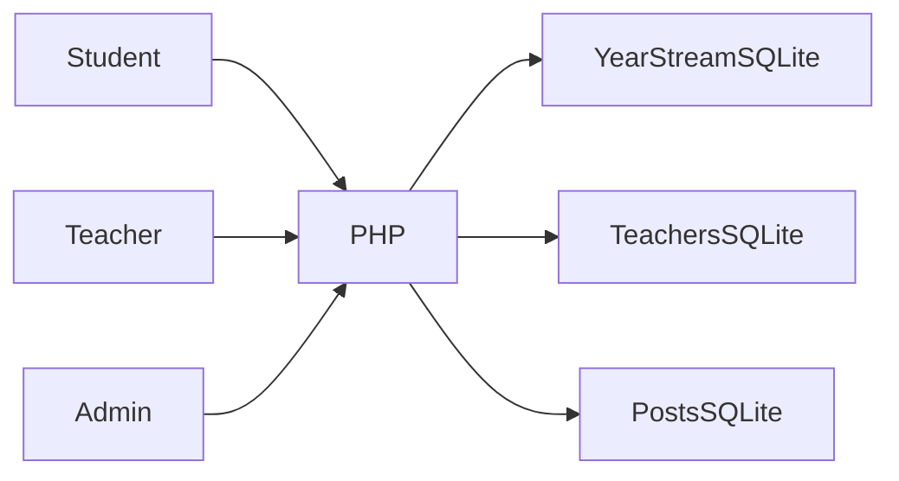

# FH-School

**A working legacy school portal**

[العربية](README.ar.md)

Give students, teachers and administrators role-specific views of academic records and school communication.

**Technology:** PHP · SQLite · JavaScript · Arabic RTL

## Status and deployment history

Older working school portal. The owner confirms the database records are fake; included fixtures are labelled synthetic.

This is a sanitized portfolio release. See the current [verification record](docs/verification.md) before choosing a runtime demonstration.

## Main workflows and implemented features

- Student dashboards and academic streams/classes
- Teacher subject/class permissions
- Grade entry, notes and absence records
- Announcements and attachments
- Teacher/student administration and charts

Student signs into an academic-year record → teacher opens a permitted subject/class → grades or attendance are saved → administrator publishes announcements and manages accounts.

## Architecture

## Engineering decisions

- Databases are distributed by year, branch and stream, with separate teachers and posts stores. The design simplifies small local datasets but complicates cross-stream reporting and migrations.
- The historical username:password field is retained for synthetic local accounts and documented accurately. It must not be used for real student credentials.
- Teacher AJAX endpoints now check authentication and the requested class/subject before execution. Public database downloads are blocked by the demo router and Apache configuration.
- Original sample state is retained as a fixture snapshot; restoring it overwrites only demo databases through an explicit reset tool.

## Directory guide

| Component | Responsibility |
|---|---|
| `student.php` | Student authentication/dashboard |
| `teacher.php` | Teacher AJAX and dashboard |
| `management.php` | Admin accounts and announcement management |
| `student_management.php` | Admin academic records |
| `data/` | Synthetic distributed SQLite stores |

## Installation

Use PHP with PDO SQLite, SQLite3 and sessions. From this repository run `php -S 127.0.0.1:8083 router.php`. Only demo databases and attachment directories should be writable. Read `docs/demo-accounts.md` for synthetic account examples. Do not expose the development server publicly. Reset via `python tools/reset_demo.py --confirm` after stopping the server.

All required/private configuration is described in [setup](docs/setup.md). Examples contain placeholders or local demo values. Never reuse historical credentials.

## Demonstration

- Sign in with one synthetic student and inspect grades/absence.
- Sign in as a teacher, open a permitted class, and save a demo change.
- Reject an unauthenticated AJAX action and a non-permitted class.
- Publish a synthetic announcement as admin and restore the fixtures.

## Verification and limitations

- PHP syntax and SQLite integrity
- Synthetic login and permission rejection
- Saved demo changes and fixture reset
- Missing database behavior

Local demonstration only for the first release. Legacy password storage and broader CSRF/input review remain relevant before using real records.

## Documentation

- [Architecture](docs/architecture.md) · [العربية](docs/architecture.ar.md)
- [Setup and configuration](docs/setup.md) · [العربية](docs/setup.ar.md)
- [Demo walkthrough](docs/demo.md) · [العربية](docs/demo.ar.md)
- [API and execution paths](docs/api.md)
- [Verification record](docs/verification.md)
- [Deployment and troubleshooting](docs/deployment.md)
- [Asset attribution](THIRD_PARTY_NOTICES.md) · [MIT license](LICENSE)

## Contributing

Open an issue describing a reproducible problem, expected behavior and component involved. Use synthetic data. Keep changes focused and include relevant checks. Do not include credentials or private user records.

## License and attribution

Source code is MIT licensed. Third-party dependencies and assets retain their own terms; see [attribution](THIRD_PARTY_NOTICES.md).

<!-- release-presentation -->

## Actual application interface

Captured from the local application with synthetic records. This does not establish production usage or Android device verification.

## Verification and deeper reading

PHP syntax and fixture HTTP checks passed: synthetic teacher login, required CSRF token, permitted class loading, foreign class/subject rejection, blocked database downloads and accessible public artwork. Browser checks passed class loading and grade editing. HTTP checks verified persisted grades, invalid-grade rejection and attendance increments; modified records were restored. Original sample SQLite records are owner-confirmed synthetic; reset snapshots are included.

Legacy synthetic passwords remain plaintext inside the sample database. Treat this release as a local legacy demonstration; real student records require a password-storage migration and broader authorization review. Teacher grade and attendance persistence passed; broader admin/student workflows and cross-role browser review remain.

- [Case study](docs/case-study.md)
- [Verification](docs/verification.md)
- [Architecture diagram](docs/architecture.svg)
- [Portfolio case study](https://mohamed-abderrehmane-portfolio.hillock-factual9mupt.chatgpt.site/projects/fh-school/)

- [Engineering details and implementation lessons](docs/engineering-notes.md)
