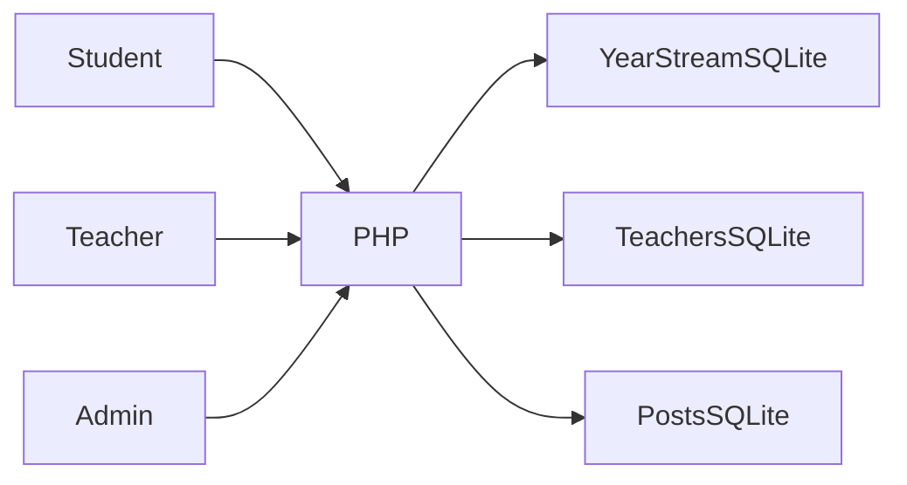

# بنية FH-School

يدخل التلميذ إلى سجل سنته ← يفتح المدرس مادة وقسماً مصرحاً بهما ← تُحفظ النقاط أو الغياب ← تنشر الإدارة الإعلانات وتدير الحسابات.

## القرارات والمفاضلات

- توزع القواعد حسب السنة والفرع والشعبة مع مخزنين للمدرسين والمنشورات. يبسط ذلك البيانات الصغيرة لكنه يصعب التقارير والترحيلات المشتركة.
- حُفظ حقل اسم المستخدم وكلمة المرور التاريخي للحسابات المحلية الاصطناعية مع توثيقه. لا يصلح لبيانات تلاميذ حقيقية.
- تتحقق مسارات AJAX للمدرس من المصادقة وصلاحيات القسم والمادة قبل التنفيذ. يُحظر تنزيل القواعد مباشرة.
- تُحفظ الحالة التجريبية الأصلية كلقطة عينات، ويستعيدها أمر صريح يستبدل قواعد العرض فقط.

## مراجع الشيفرة

- [student.php](../student.php)
- [teacher.php](../teacher.php)
- [management.php](../management.php)
- [student_management.php](../student_management.php)

## الحدود

عرض محلي للإصدار الأول. يلزم تحديث تخزين كلمات المرور ومراجعة CSRF والمدخلات قبل استخدام سجلات حقيقية.
