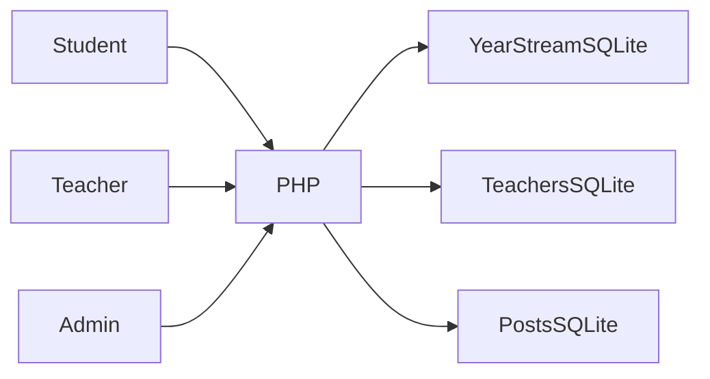

# FH-School architecture

Student signs into an academic-year record → teacher opens a permitted subject/class → grades or attendance are saved → administrator publishes announcements and manages accounts.

## Decisions and tradeoffs

- Databases are distributed by year, branch and stream, with separate teachers and posts stores. The design simplifies small local datasets but complicates cross-stream reporting and migrations.
- The historical username:password field is retained for synthetic local accounts and documented accurately. It must not be used for real student credentials.
- Teacher AJAX endpoints now check authentication and the requested class/subject before execution. Public database downloads are blocked by the demo router and Apache configuration.
- Original sample state is retained as a fixture snapshot; restoring it overwrites only demo databases through an explicit reset tool.

## Component boundaries

| Component | Responsibility |
|---|---|
| `student.php` | Student authentication/dashboard |
| `teacher.php` | Teacher AJAX and dashboard |
| `management.php` | Admin accounts and announcement management |
| `student_management.php` | Admin academic records |
| `data/` | Synthetic distributed SQLite stores |

## Source evidence

- [student.php](../student.php)
- [teacher.php](../teacher.php)
- [management.php](../management.php)
- [student_management.php](../student_management.php)

## Limits

Local demonstration only for the first release. Legacy password storage and broader CSRF/input review remain relevant before using real records.
